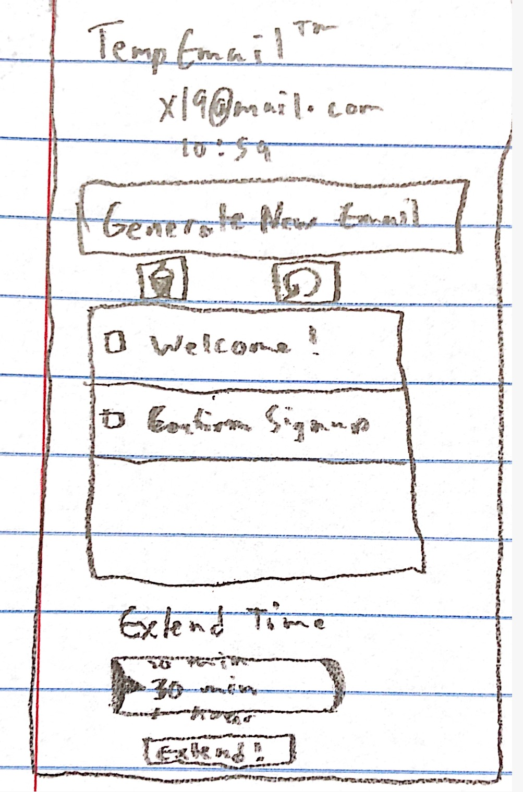

Goal
---
Develop a temporary email app with similar functionality to 10minutemail.com. The app should follow
good iOS development practices and conform to Apple UI/UX standards. 

TODO
---
- [ ] create temporary email address
- [ ] access emails
- [ ] manually refresh for new mail
- [ ] extend time that email address is valid
- [ ] keep email available when app closed and re-opened

Low Fidelity Prototype
---

Above is the low fidelity prototype. The temporary email address and time left before it is deleted are listed on top, followed by an option to create a new email. This button will cause the old temporary email to be deleted (if it already exists) and create a new email. Below that button is the trash and refresh buttons, which modify the inbox. Below the inbox is an option to extend the default time before deletion, which utilizes a modal to go through the options for extension time.
